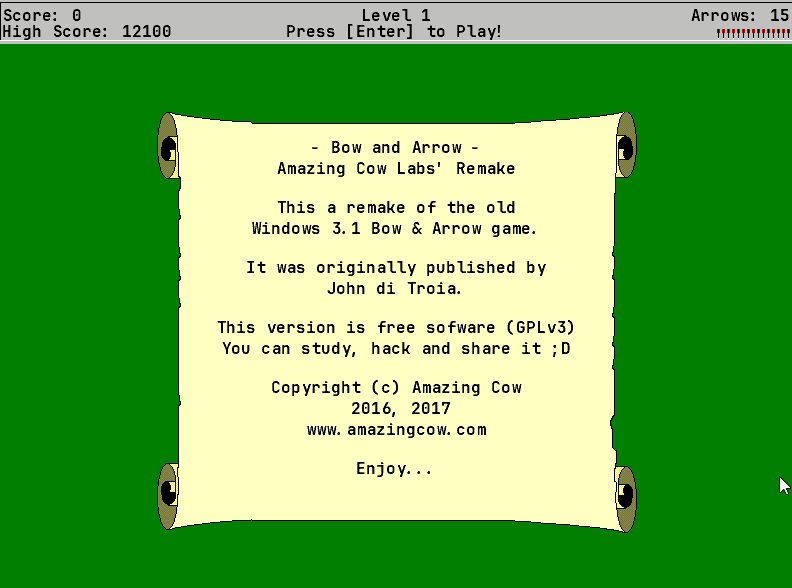

# Bow and Arrow

**Made with <3 by [mateus.digital](https://mateus.digital).**

## Description:

<p align="center">
    
</p>

Bow and Arrow is a small _"quasi"_-remake of the John di Troia's Bow & Arrow.
You can find more info about the original game in
[Classic DOS Games](http://www.classicdosgames.com/game/Bow_and_Arrow_-_In_Search_of_the_Greatest_Archer.html)

It was developed in C# using [Monogame](http://www.monogame.net/).


For a long time I forgot this project, but decided to release it now :)

<br>

As usual, you are **very welcomed** to **share** and **hack** it.

## Dedication

This game is dedicated to
[Instituto Mario Penna](http://www.mariopenna.org.br/).

Take a 5 min break, take a look their site and find a way to help them :D

Thanks! <3


## Building


```powershell
git clone https://github.com/mateusdigital/bow_and_arrow
cd bow_and_arrow

./scripts/build-game.ps1            ## Builds the platform version of the game.
./scripts/generate-release-zip.ps1  ## Packages the game and resources to distribution.
```

## Dependencies:

* [Monogame](http://www.monogame.net/).


## Thanks to:

I used a lot of free and open resources, for which I'm most grateful!


## License:

This software is released under [GPLv3](https://www.gnu.org/licenses/gpl-3.0.en.html).


## Others:

- Email: hello@mateus.digital
- Website: https://mateus.digital
- Itch.io: https://mateusdigital.itch.io
- Linkedin: https://www.linkedin.com/in/mateusdigital
- Twitter: https://www.twitter.com/_mateusdigital
- Youtube: https://www.youtube.com/@_mateusdigital

There's more FLOSS things at [mateus.digital](https://mateus.digital) :)
